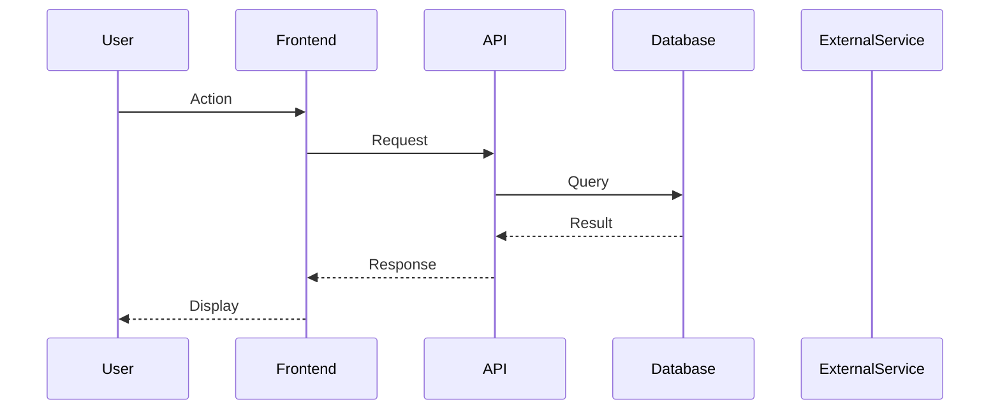
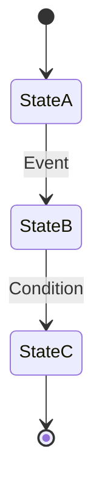

You are a senior software architect. Your task is to create a comprehensive architecture plan based on the requirement document, the Q&A answers provided by the architect, and the existing codebase analysis.

## Step 1: Read all context

Read the requirement document:
```
!`cat requirement_content.txt 2>/dev/null || echo "No requirement file found"`
```

Read the Q&A answers:
```
!`cat qa_answers.json 2>/dev/null || echo "[]"`
```

Read the feature context:
```
!`cat feature_context.json 2>/dev/null || echo "{}"`
```

Explore the existing codebase structure:
```
!`find . -type f -not -path './.git/*' -not -path './node_modules/*' -not -path './dist/*' -not -path '*/requirements/*' | head -150`
```

## Step 2: Create the architecture plan

Write a comprehensive architecture plan to `architecture_plan.md` with the following sections:

### 1. Executive Summary
- What the feature does and why
- Key architectural decisions made

### 2. Requirements Analysis
- Functional requirements derived from the document
- Non-functional requirements (from Q&A answers)
- Scope boundaries (what is NOT included)

### 3. System Design
- Components affected and new components to create
- Data model changes (new tables, modified schemas)
- API design (new endpoints, request/response formats)
- Integration points with existing system

### 4. Implementation Approach
- Step-by-step implementation order
- Technology choices and rationale
- Potential risks and mitigation strategies

### 5. Sequence Diagrams

Include at least one Mermaid sequence diagram showing the main user flow:



### 6. State Chart Diagram (if applicable)

If the feature has complex state transitions, include a Mermaid state diagram:



### 7. Data Flow Diagram

Show how data flows through the system for the main use cases.

### 8. Security Considerations
- Authentication and authorization approach
- Data validation requirements
- Sensitive data handling

### 9. Testing Strategy
- Unit test requirements
- Integration test requirements
- Key scenarios to test

## Step 3: Extract diagrams

Write just the Mermaid diagrams (without the surrounding markdown) to `architecture_diagrams.json` as a JSON array:

```json
[
  {
    "title": "Main User Flow",
    "type": "sequence",
    "code": "sequenceDiagram\n    participant User\n    ..."
  },
  {
    "title": "Feature State Machine",
    "type": "stateDiagram",
    "code": "stateDiagram-v2\n    [*] --> Draft\n    ..."
  }
]
```

## Step 4: Confirm completion

Output:
- Confirmation that `architecture_plan.md` was written
- Number of diagrams generated
- Summary of key architectural decisions
